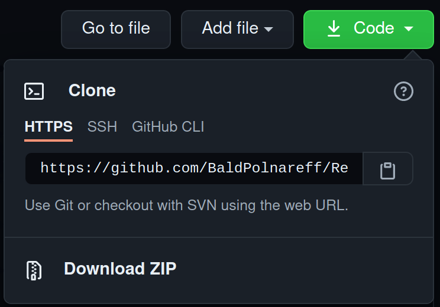

# Relazione_individuale_Veicoli_Aerospaziali

You can find the *bibliography* used in this work (as well as all my other University projects and thesis) [here](https://github.com/BaldPolnareff/Bibliography).
## Directories in this repository
+ ***Main Directory***
    + This **Readme** file, please read it
    + A **LaTeX** document called "*Relazione_individuale.tex*"
    + The **pdf** compiled from LaTeX, called "*Relazione_individuale.pdf*"
    
        I highly recommend reading the document with a pdf reader that can handle hyperref. Most pdf readers should be able to do that.
    + Several other files that are a result of [Vscodium](https://vscodium.com/) building the LaTeX project (they should be ignored)
    + A ***Code*** directory, with MATLAB/Octave sources
        + The file *Main.m* is the main script, all other matlab files are
        custom functions, which are called by the script.

            Bear in mind that in *Octave* you can run the *Main.m* and all plots will appear at once. In some *Matlab* versions, the built-in function *figure()* is overwritten when called within a custom function, so you may need to run each section separately.
            The script has been successfully tested in both *Octave* and *Matlab*.
    
    + A ***Sources*** directory, with images and other files used in the assignment

        + A spreadsheet by *ICAO*, containing valuable information on aeronautical engines, called "*edb-emissions-databank v27-NewFormat (web).xlsx*"
        + A **GE Aircraft Engines** directory, containing lots of datasheet pdfs of *General Electric* engines
        + A **Plots_and_Pictures** directory, containing all image files used in the assignment
        + A **CAD** directory, containing all Solidworks parts and assembly
        + An **AifroilData** directory, containing raw data for some airfoils and *spreadsheets* with the renormalized data

## How to Download this repository (or any git repository)

You can directly download a *.zip* compressed archive of this repository

 

Or even better, you can clone the repository using [git](https://git-scm.com/book/en/v2/Getting-Started-Installing-Git) on any Operating System

If you have git installed on your system, open a terminal (on Linux, MacOS or Windows) and run:

        git clone https://github.com/BaldPolnareff/Relazione_individuale_Veicoli_Aerospaziali.git